# Organima — arquitectura C4

Fecha: 22 de septiembre de 2026. Base C4: `33699e2`; revisión Jev Gateway sobre `8cce478`, rama `feat/voice-latency-lab`. Este documento describe la implementación inspeccionada, no promete que todos los componentes estén desplegados juntos. La robótica que se construye en otra conversación queda fuera de esta verificación.

## Cómo leer el mapa

El mapa de sistemas distingue núcleo y laboratorio. Cada zoom mantiene su alcance y los cuatro niveles se leen como: **contexto → contenedores → componentes → código**. “Contenedor” significa aplicación ejecutable o almacén de datos; no implica Docker. Las vistas C1/C2 usan flechas de dependencia: el origen solicita una capacidad al destino. Los flujos de datos y secuencias se identifican aparte. En C1 se omiten protocolos; en C2 se especifican. Una flecha discontinua marcada **pendiente** es una integración propuesta. Las implementaciones en modo simulación no son evidencia de funcionamiento físico.

| Área | Estado en esta revisión |
|---|---|
| Núcleo Organima | TypeScript/Express; memoria, conversación, observación y objetivos implementados. Puede arrancar en `simulation` o `live`. |
| Demo pública | Despliegue separado del laboratorio; última verificación anterior en simulación. No se volvió a verificar su versión durante esta documentación. |
| Laboratorio conversacional | Aplicación local independiente; NVIDIA y ElevenLabs Agents completos probados con servicios reales en el trabajo previo. Rama de PR, no integrado en la demo pública. |
| Robot | Máquina de estados y simulador implementados. El adaptador de esta rama rechaza objetivos en modo real porque no tiene conexión física. |
| Visión | MiniCPM en Nebius. **No es actualmente un modelo NVIDIA.** |
| Jev / Prime Agent | Adaptador Jev vía Vercel integrado; primera llamada real bloqueada por facturación (403). Prime Agent sigue sin integración. |

## Mapa de sistemas · Organima y su laboratorio

**Tipo:** paisaje de sistemas (*system landscape*), vista complementaria. **Alcance:** proyecto Organima, no todo ABRAXA. **Audiencia:** equipo y presentación del proyecto. Separamos el núcleo —operación con memoria y objetivos— del laboratorio —comparación de agentes de voz— como dos sistemas de interés por su función y sus sesiones independientes. Compartir código o repositorio no implica compartir estado.

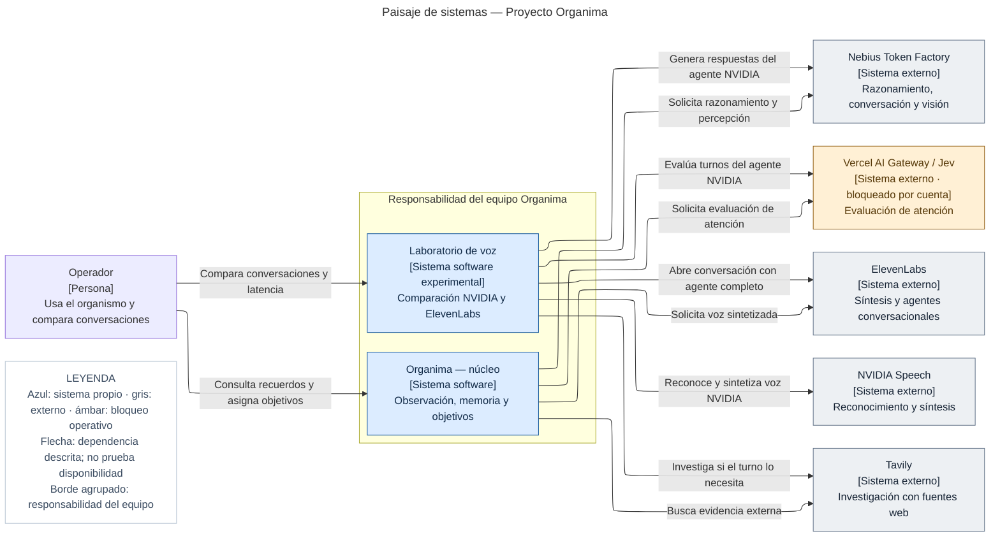

No hay una conexión operativa entre laboratorio y núcleo. GitHub pertenece al ciclo de construcción y distribución, no a una consulta de memoria remota por turno. La robótica física pendiente se muestra en su sección de integración futura, no como un sistema ya conectado.

## Nivel 1 · Contextos de sistema

### 1A · Contexto de Organima — núcleo

**Alcance:** un sistema, Organima núcleo. **Audiencia:** técnica y no técnica. Esta vista responde quién lo utiliza y qué obtiene de otros sistemas. No representa procesos, librerías, protocolos ni servidores.

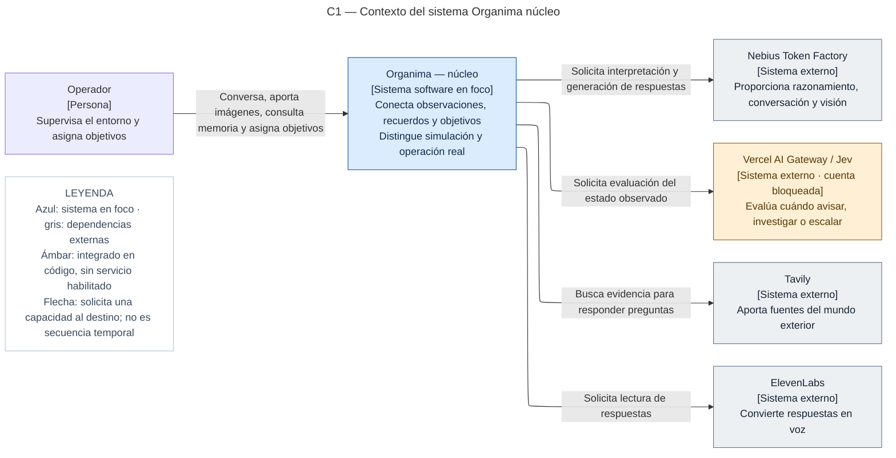

Tavily es el proveedor de investigación web. Nebius y los servicios de voz son dependencias de inferencia; no constituyen fuentes de investigación sustitutivas. La simulación no llama a esas dependencias reales.

### 1B · Contexto del laboratorio de voz

**Alcance:** un sistema experimental independiente. **Audiencia:** equipo que compara agentes. La conversación de ElevenLabs ocurre en su plataforma; la cadena NVIDIA utiliza Nebius para generar respuestas y Jev para evaluar atención cuando está seleccionado.

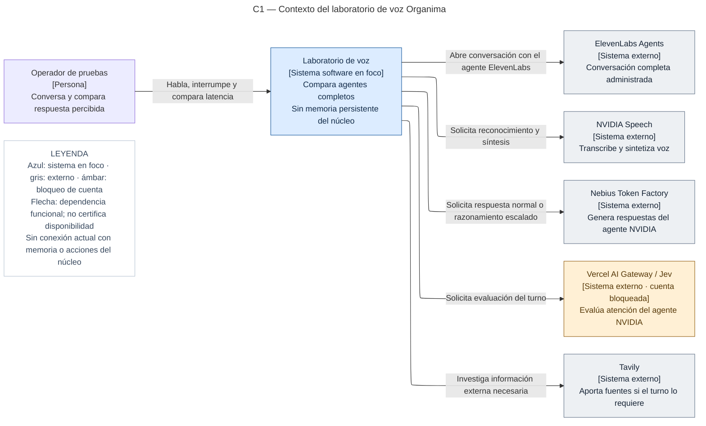

## Nivel 2 · Contenedores lógicos

Estas vistas amplían cada sistema anterior. Las fronteras agrupan software bajo responsabilidad de Organima; no indican máquinas físicas. Los entornos, puertos y procesos supervisores se describen por separado en [RUNBOOK.md](RUNBOOK.md).

### 2A · Contenedores de Organima — núcleo

**Alcance:** sistema Organima núcleo. **Audiencia:** desarrollo y operación. El núcleo es un monolito modular: las células no son microservicios. Los contextos y la proyección del grafo viven en la aplicación servidor, no en un servicio aparte.

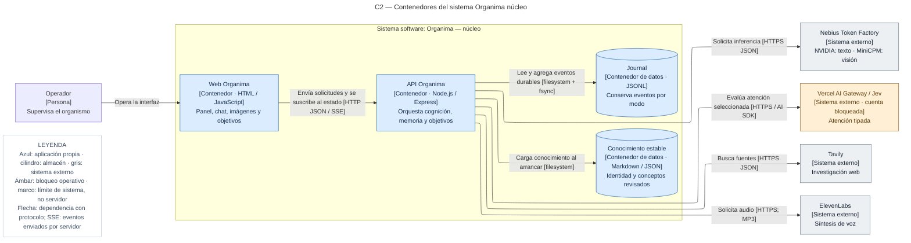

El código separa `runtime/simulation` de `runtime/live`. Los archivos de conocimiento llegan con el checkout revisado del repositorio. La implementación de esta rama conserva el robot simulado; en modo real el puerto robot se declara desconectado.

### 2B · Contenedores del laboratorio

**Alcance:** sistema laboratorio de voz. **Audiencia:** desarrollo y operación. Se representan dependencias entre procesos; los intercambios de audio y su secuencia se amplían en componentes y en la vista de flujo de código.

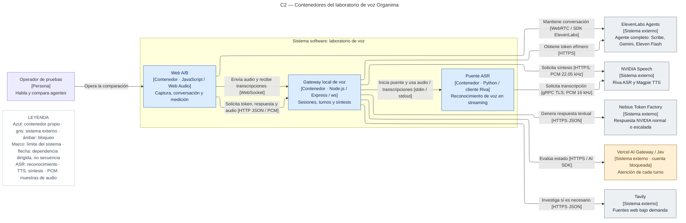

ElevenLabs no usa Nebius para su conversación. NVIDIA sigue la cadena Riva → Jev seleccionado → NVIDIA en Nebius → Magpie. El historial de esa prueba vive en el navegador; el grafo entregado al cerebro está vacío y no se escribe en el journal del núcleo. Puertos, TLS de entrada y supervisión de procesos son decisiones de despliegue, no contenedores adicionales de negocio.

## Nivel 3 · Componentes

### 3A · Dentro del núcleo Express

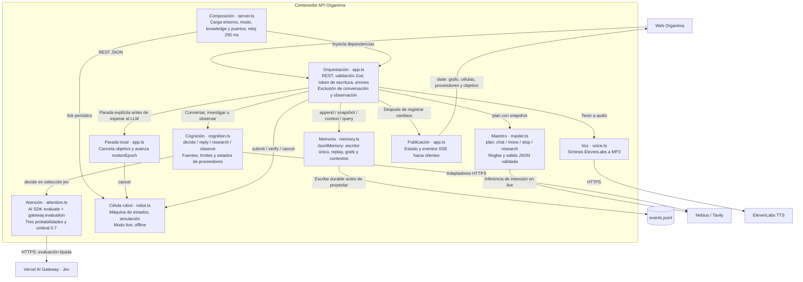

- **Maestro:** selecciona intención; no escribe recuerdos ni ejecuta motores. El servidor valida y despacha. Las consultas simples sobre la última posición y la presentación tienen respuesta local.
- **Cognición:** atención decide si investigar/notificar; conversación construye la respuesta; visión transforma una imagen en relaciones con fuente, fecha y confianza. La atención no es un agente autónomo permanentemente corriendo.
- **Proactividad:** `/api/observe` persiste relaciones, intenta verificar el objetivo, evalúa cambios y puede devolver un anuncio. Requiere que lleguen observaciones; no hay aquí una red automática de cámaras de vigilancia.
- **Parada:** `/api/stop` y expresiones explícitas de parada no esperan al razonamiento. `motionEpoch` impide que una orden de movimiento pendiente de inferencia sobreviva a una parada posterior.
- **Salida:** SSE actualiza el panel; no es un bus distribuido ni una cola de mensajes externa.

### 3B · Dentro del laboratorio de voz

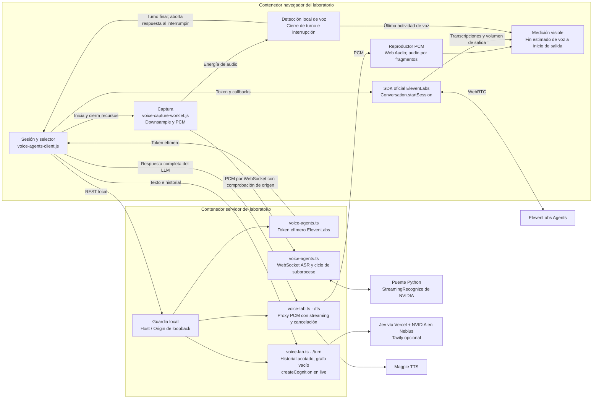

En NVIDIA se espera la respuesta textual completa del cerebro antes de solicitar TTS; la síntesis sí se reproduce por fragmentos. Esto introduce latencia acumulada. ElevenLabs administra su propia detección de turnos e interrupciones. Las métricas del panel son estimaciones de software y usan mecanismos distintos: planificación de audio en NVIDIA y detección del volumen de salida en ElevenLabs; no son mediciones acústicas comparables con precisión de laboratorio.

## Nivel 4 · Código y contratos

### 4A · Dominio y puertos del núcleo

Este diagrama usa nombres reales. `JsonlMemory` es una clase; los puertos son interfaces. `createApp`, `createMaster`, `createRobot` y `createCognition` son funciones de fábrica, no clases ni servicios desplegados por separado.

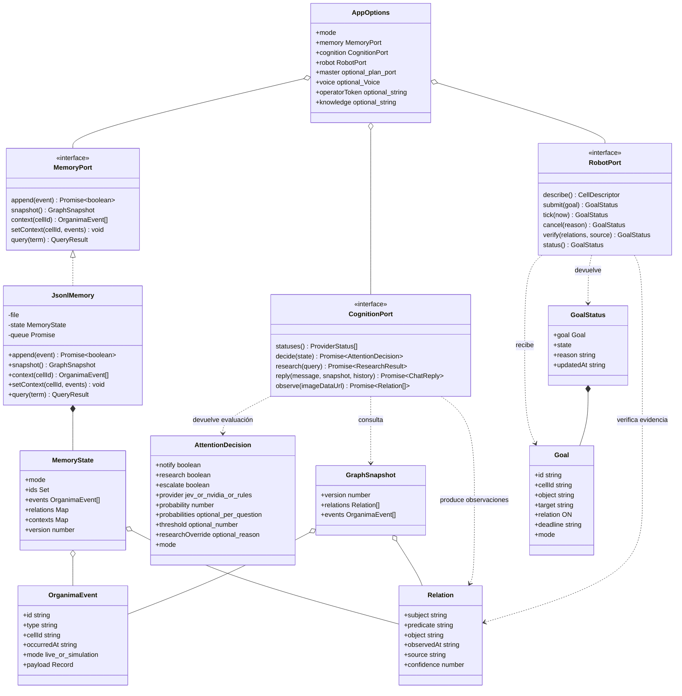

`QueryResult` en el dibujo abrevia el retorno estructural `{relations, events}`; `optional_plan_port` abrevia `{plan(message, snapshot): Promise<Intent>}`. No son clases adicionales existentes. Las firmas omiten algunos detalles de nulabilidad para legibilidad: `tick`, `cancel`, `verify` y `status` pueden devolver `null`.

### 4B · Funciones y llamadas de la conversación NVIDIA

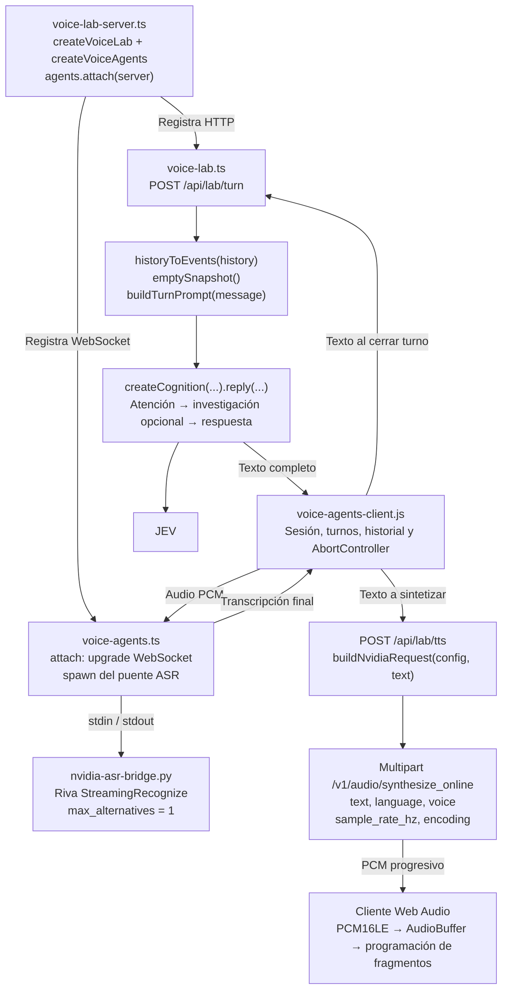

La cancelación atraviesa navegador, solicitudes HTTP y reproducción; un identificador de generación descarta respuestas tardías. Cerrar una sesión ASR cierra el socket y termina el subproceso. El gateway limita sesiones, tamaño de mensajes y duración. Las claves de proveedores permanecen en el servidor; el navegador ElevenLabs recibe un token efímero.

## Las tres memorias, sin confundirlas con los cuatro niveles C4

| Memoria | Implementación real | Escritura y lectura | Persistencia / límite |
|---|---|---|---|
| 1 · Contexto inmediato | `MemoryState.contexts`, `Map` por célula | `setContext` / `context`; el chat usa `voice` | RAM; últimos 20 eventos por contexto. No se reconstruye al reiniciar. |
| 2 · Grafo compartido | `Map` de relaciones derivado del journal | Sólo `observation` y `hidden` aportan relaciones; `snapshot` y `query` consultan | Journal durable y replay; una relación vigente por `subject + predicate`. |
| 3 · Conocimiento estable | `knowledge/identity.md`, `knowledge/objects.json` | Carga al arrancar; contenido inyectado al chat que usa cognición | Archivos versionados con Git/GitHub. Sin consolidación automática implementada. |

**World State** es `GraphSnapshot`, una vista del nivel 2; no una cuarta memoria. Devuelve todas las relaciones actuales y hasta 100 eventos recientes. El journal conserva también conversaciones, fuentes, atención y objetivos, pero estos tipos no se convierten automáticamente en aristas del grafo. `query` busca texto, no embeddings ni consultas semánticas de base de grafos.

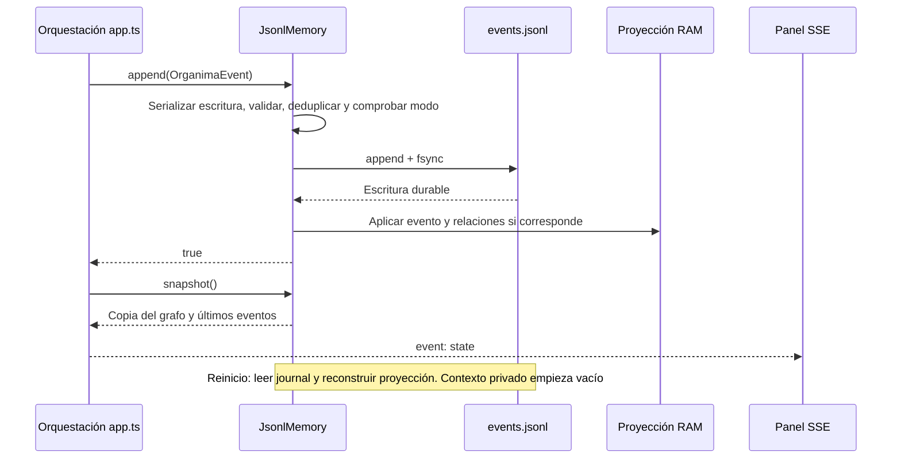

El límite por defecto del journal es 50 MiB: al alcanzarlo se rechaza la escritura sin descartar datos. El proceso mantiene los eventos cargados en RAM; no hay todavía compactación automática, índice semántico ni escalado a múltiples escritores. Una observación antigua no reemplaza otra más reciente del mismo sujeto y predicado.

## Objetivos del robot y frontera física

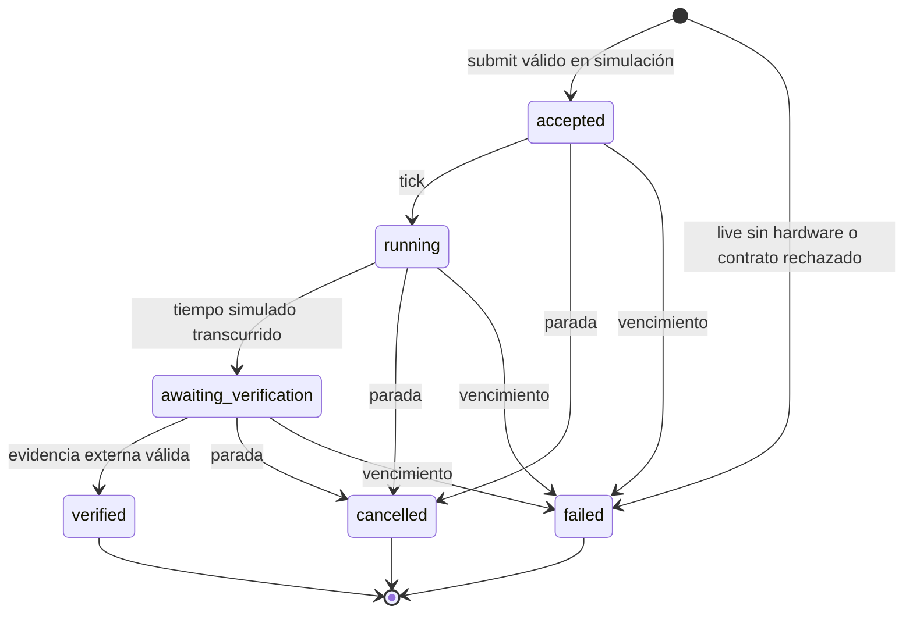

El objetivo admitido por la API es `red_ball ON paper`. La verificación requiere fuente `vision_global`, confianza al menos 0.85 y evidencia posterior al comienzo de la espera de verificación, sin fecha futura. Esto verifica una observación; no demuestra por sí solo causalidad física. El robot no se autocertifica como exitoso.

**Diseño físico pendiente de integración:** adaptador de objetivos en Jetson; navegación usando cámara propia; controlador Arduino/MCU para motores y sensores; watchdog, caducidad de órdenes y parada local por borde/obstáculo. No se afirman pines, modelos de sensores ni firmware instalado. El botón web de parada no sustituye una parada local de hardware. El trabajo físico paralelo debe contrastarse antes de actualizar este límite.

## Contratos HTTP principales

| Ruta | Uso y frontera |
|---|---|
| `GET /api/health`, `/api/state` | Salud, modo y estado agregado. `hardwareConnected` es falso en esta implementación. |
| `GET /api/events` | SSE de estado; heartbeat. |
| `GET /api/memory?q=...` | Búsqueda textual en relaciones y eventos. |
| `POST /api/chat` | Planificación, despacho, respuesta y registro de conversación. |
| `POST /api/observe` | Imagen → relaciones → persistencia → verificación → atención. |
| `POST /api/research` | Tavily y persistencia de fuentes. |
| `POST /api/goals`, `/api/stop` | Objetivo acotado y cancelación. |
| `POST /api/demo/step` | Escenario explícitamente simulado; rechazado en live. |
| `GET /api/voice`, `POST /api/voice` | Estado y síntesis del núcleo. |
| `GET /api/lab/agents/status` | Disponibilidad configurada de proveedores del laboratorio. |
| `POST /api/lab/agents/elevenlabs-session` | Token efímero para WebRTC. |
| `WS /api/lab/agents/nvidia-asr` | Audio de micrófono y transcripciones. |
| `POST /api/lab/turn`, `/api/lab/tts` | Cerebro NVIDIA e interfaz de audio en streaming. |

Las escrituras del núcleo requieren `X-Organima-Token` cuando se configura; los GET son públicos. Es un diseño de demo de operador único, no aislamiento multiusuario. El laboratorio sólo escucha en loopback y aplica comprobaciones de Host/Origin; no debe confundirse con un despliegue público autenticado.

## Decisiones abiertas que el mapa hace visibles

1. **Integración de voz:** elegir proveedor y conectar su conversación al maestro y a las tres memorias mediante contratos explícitos. Hoy el laboratorio no registra recuerdos del núcleo ni llama a sus acciones.
2. **Latencia NVIDIA:** actualmente hay detección de turno, ASR, evaluación Jev, posible Tavily, generación completa y TTS. Para optimizar habrá que medir cada tramo y evaluar salida incremental del cerebro; cambiar sólo la voz no elimina los demás pasos.
3. **Memoria estable:** falta el flujo de propuesta, revisión y publicación de consolidaciones. GitHub ya versiona archivos, pero no funciona como una memoria autónoma que se escribe sola.
4. **Percepción NVIDIA:** la visión sigue en MiniCPM. NVIDIA sí está presente en razonamiento y conversación; migrar visión requiere verificar un modelo disponible y su calidad.
5. **Hardware:** conectar y validar el adaptador físico con la otra conversación; conservar límites, caducidad y prioridad de seguridad local.
6. **Operación pública:** integrar y desplegar la rama después de revisión. El PR del laboratorio sigue separado; la revisión de Opus quedó bloqueada por autenticación en el trabajo previo.

Jev interpreta el estado acotado de la memoria, sin escribir directamente en ella. Sus decisiones se conservan en los eventos de atención y conversación. `probabilities` contiene las tres probabilidades; `probability` es su máximo por compatibilidad, no una confianza conjunta ni una medida calibrada. La selección `nvidia` conserva el modo anterior; no se activa automáticamente cuando falla Jev. En `simulation` sólo se usan reglas.

DeepSeek constructor y Opus juez pertenecen al **proceso de construcción**, no al runtime del producto. No hay un Prime Agent ejecutándose como maestro: el maestro actual es `createMaster` y sus contratos acotados.

## Trazabilidad a código

- [Composición del núcleo](../src/server.ts) y [orquestación HTTP/SSE](../src/app.ts).
- [Contratos](../src/contracts.ts), [maestro](../src/master.ts), [cognición y proveedores](../src/cognition.ts).
- [Evaluador Jev](../src/attention.ts) y [guía Jev](JEV.md).
- [Memoria y journal](../src/memory.ts), [robot](../src/robot.ts), [voz del núcleo](../src/voice.ts).
- [Arranque del laboratorio](../src/voice-lab-server.ts), [turnos y TTS](../src/voice-lab.ts), [sesiones y ASR](../src/voice-agents.ts).
- [Cliente conversacional](../scripts/voice-agents-client.js), [captura](../public/voice-capture-worklet.js), [puente Python](../scripts/nvidia-asr-bridge.py).
- [Guía de prueba conversacional](VOICE-AGENTS.md) y [contrato propuesto del robot](ROBOT-CONTRACT.md).

Las vistas C4 se expresan con Mermaid para poder revisarlas en GitHub. Los diagramas de secuencia y estados son vistas complementarias; no reemplazan el nivel de código.

## Auditoría C4

La revisión y las decisiones de notación están documentadas en [C4-AUDIT.md](C4-AUDIT.md). Referencias oficiales: [contexto](https://c4model.com/diagrams/system-context), [contenedores](https://c4model.com/diagrams/container), [paisaje de sistemas](https://c4model.com/diagrams/system-landscape), [notación](https://c4model.com/diagrams/notation) y [lista de revisión](https://c4model.com/diagrams/checklist).
